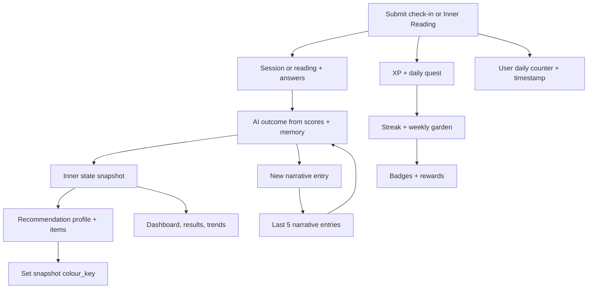

# Gio database audit — 2026-09-23

## Scope and evidence

This audit covers all **21 application tables** in the supplied pgAdmin screenshot. It traces where records are created, updated, read, and linked; the business rules behind those operations; and the member-app flows that invoke them. It describes the implementation currently in this workspace, including unfinished and legacy paths.

Read-only inspection of `gio-backend-db-1`, database `gio`, confirmed all 21 tables plus the infrastructure table `alembic_version`. The recorded migration is `d9b5ce16447b`, the head of the migration chain in this checkout. PostgreSQL indexes, foreign keys, and check constraints were inspected. `information_schema.triggers` returned no application triggers. No user content was exported, no database records were changed, and no application fixes were made.

The findings below are based on source inspection and live schema metadata, **not execution of every business flow or a row-by-row data-quality audit**. Potential concurrency failures are identified from implementation patterns, not reproduced against the live database.

All API paths below have the prefix **`/api/v1`**. Source links are relative to this document. Function names identify the exact implementation within a file.

## Flow overview

| Member action | Main database activity |
|---|---|
| Register | Insert `users` and its `subscriptions` row together. |
| Log in | Read credentials from `users`; update `last_login_at`. No backend LOGIN quest write. |
| Complete birthdate onboarding | Insert `core_personalities`; update user birthdate/onboarding time; later update the personality with the second language. |
| Open a check-in session | Read or generate a shared `check_in_question_sets` row. Opening the page can write this cache. |
| Submit a check-in | Insert session and answers; create state, memory, recommendations; update daily counter and gamification. |
| Open an Inner Reading | Read or generate a shared `inner_reading_question_sets` row. |
| Submit an Inner Reading | Check entitlement, insert reading and answers; create state, memory, recommendations; update daily counter and gamification. |
| View dashboard/progress | Read state/history/recommendations/progress; `GET /progress` can create streak/garden rows and reset the garden week. |
| Write a journal entry | Insert `journal_entries` with deterministic mood/theme tags. No reflection cascade. |
| Subscribe/cancel/reactivate/start trial | Update the existing `subscriptions` row; access is computed from that row. |
| Redeem a reward | Update `user_rewards` from UNLOCKED to REDEEMED. |

This is a logical dependency diagram; the exact order differs between the two submission handlers. In particular, Inner Reading generates its outcome before inserting the reading row.

### Shared scoring and transaction rules

- [scoring.py](../app/services/scoring.py), `normalize`: raw answer 1–5 becomes 0, 25, 50, 75, 100 via `round(((value - 1) / 4) * 100)`.
- `dimension_averages`: average answers for each of emotional energy, mental clarity, inner pressure, and grounding. Missing dimensions default to 50.
- `resolve_focus_key`: compare `100 - energy`, `100 - clarity`, `pressure`, and `100 - grounding`. The greatest need wins if it is at least 55; otherwise focus is balanced. Ties follow the listed order.
- [ai_outcome.py](../app/services/ai_outcome.py) writes English outcome text from these computed scores, the deterministic focus label, and the last five narrative summaries. It does not receive the check-in private note, raw question text, journal entries, or Core Personality summaries.
- [cascade.py](../app/services/cascade.py), `apply_reflection_side_effects`, is the shared writer for state, gamification, and recommendations. The endpoint commits once after adding narrative memory and updating the user. A failure before that commit leaves no committed submission bundle when the session closes.
- Question generation is a separate request and separate commit: its cache row can remain even if the later submission fails or is abandoned.
- [database.py](../app/database.py) sets `autoflush=False`. A query does not automatically see pending inserts until the service explicitly flushes or commits. This matters for the daily quest bonus finding below.
- Daily counters, XP deduplication, and streaks use UTC dates. Garden weeks start Monday in UTC. The free reading limit is a rolling seven-day window, not the garden calendar week.

## Table-by-table audit

### 1. `check_in_answers`

**Purpose and ownership:** One row per submitted check-in answer; belongs to `check_in_sessions` through `check_in_session_id`. The normal UI supplies four answers, one per dimension.

**Writes:** [checkins.py](../app/api/v1/endpoints/checkins.py), `submit_check_in`, invoked by `POST /check-ins`. For each payload answer it inserts `dimension`, client-supplied `question_text`, raw `answer_value`, calculated `normalized_value`, sequential `order_index`, and `answered_at`. There is no normal edit/update endpoint.

**Reads/references:** The submit handler scores the normalized in-memory answer list. Later, the `CheckInSession.answers` relationship loads stored answers in order for `GET /check-ins`, `GET /check-ins/{id}`, and `GET /check-ins/{id}/results`; the serializers return them to the client.

**UI flow:** [check-in/session.tsx](../../gio-member-app/pages/check-in/session.tsx) submits through `lib/api/reflections.ts`; check-in history/detail/results consume the session response. Dashboard history also loads sessions with their answer data.

**Lifecycle/constraints:** Parent deletion cascades to answers. No question-set foreign key and no uniqueness on `(session, dimension)` or `(session, order_index)`. The API does not enforce answer count, known dimensions, or the documented 1–5 range; see finding F3.

### 2. `check_in_question_sets`

**Purpose and ownership:** Global reusable question cache, shared across users for each `(date, increment)`, not a per-user table.

**Writes:** `GET /check-ins/questions` → [questions.py](../app/services/questions.py), `get_or_generate_checkin_question_set`. It looks up today's UTC date and the user's next daily check-in number. On a miss, [ai_questions.py](../app/services/ai_questions.py), `generate_checkin_questions`, generates four questions, stores JSONB `questions` plus `blueprint_version="checkin-v1-ai"`, flushes, and the endpoint commits. Existing sets are reused without updates.

**Increment logic:** `next_check_in_increment` returns 1 when no prior check-in exists or the previous one was before today; otherwise stored count + 1. Fetching questions does not advance the user's count. A successful submission does.

**Reads/references:** Only the question-fetch service reads this cache in the runtime backend. Submission accepts copied question text from the client and does not retrieve/verify the cached row. No session or answer foreign key points to it.

**UI flow:** Opening [check-in/session.tsx](../../gio-member-app/pages/check-in/session.tsx). Reloading before submission normally reuses the same set. Different users at the same date/increment share it.

**Lifecycle/constraints:** Unique `(date, increment)`; no expiration or cleanup job found. Concurrent cache misses can collide at insertion. Historical migration `e0d8e3049903` backfilled existing increments to 1.

### 3. `check_in_sessions`

**Purpose and ownership:** The user's completed check-in event, including optional private note, summary label, timestamps, and narrative-memory backlink.

**Writes:** [checkins.py](../app/api/v1/endpoints/checkins.py), `submit_check_in`, inserts a session with `source=WEB`, `status=COMPLETED`, both `started_at` and `completed_at` set to submission time, and `private_note` from the payload. After outcome generation/cascade it sets `summary="Check-in — {focus label}"` and `narrative_entry_id`. All writes belong to the submission transaction.

**Reads/references:** List, detail, and results endpoints query by current user. Free list history is restricted to the last seven days; Premium/trial sees all. Direct detail/results endpoints check ownership but do not apply that history cutoff. Answers, snapshots, narrative entries, and recommendation profiles refer to the session.

**UI flow:** Check-in session → completion result; check-in index/history; dashboard recent activity.

**Lifecycle/constraints:** No draft row is created when questions are opened and no edit/delete route exists. User deletion cascades to sessions. Deleting a session cascades to its answers, source snapshots, narrative entries, and trigger recommendations. Deleting its narrative entry sets the session backlink to NULL.

**Notable mismatch:** The submit handler stores `blueprint_version="checkin-v1-demo"` even though the current question-fetch path produces `checkin-v1-ai`. Private notes are stored and returned but are not used for AI outcome generation.

### 4. `core_personalities`

**Purpose and ownership:** One relatively stable personality record per user, with deterministic numerology/colour weights and generated bilingual text. Unique `user_id`; this is no longer a versioned archetype-quiz table.

**Writes:** [core_personality.py](../app/api/v1/endpoints/core_personality.py), `calculate`, handles `POST /core-personality/calculate`. It computes birthday/life-path/talent numbers and five colour scores using [numerology.py](../app/services/numerology.py), generates the requested language, and inserts the row with `primary_language` and `generation_status=PARTIAL`. It also stores `users.birthdate` and completes onboarding. If a row already exists, it returns that row and only fills a missing onboarding completion timestamp; it does not replace the birthdate or regenerate content.

**Second update:** `_generate_secondary_language` runs after the response using its own database session. It fills the other language's title/subtitle/overview/numerology descriptions/summary and changes status to READY, then commits. It does not overwrite numeric scores.

**Reads/references:** `GET /core-personality/current` and `GET /core-personality/{id}/results`; `user.core_personality` in reflection submission; optional `recommendation_profiles.core_personality_id`. Recommendations use the English title for routine reason wording, not the full personality/colour scores as a selection algorithm. Core summaries are exposed in the core result schema but have no downstream recommendation grounding reader in the current service.

**UI flow:** [onboarding.tsx](../../gio-member-app/pages/onboarding.tsx), onboarding results, [core-personality.tsx](../../gio-member-app/pages/core-personality.tsx), dashboard.

**Lifecycle/constraints:** User FK cascades. Recommendation FK to personality has default NO ACTION, so deleting a referenced personality alone is blocked. No working recalibration path for this new model was found. Old `/personality` routes remain registered but reference removed columns; see F1. Secondary-language failure can leave PARTIAL indefinitely; see F9.

### 5. `garden_progress`

**Purpose and ownership:** One mutable weekly garden row per user; `user_id` is the primary key. Stores current `week_start`, `actions_this_week`, and `stage`.

**Writes:** [gamification.py](../app/services/gamification.py), `get_or_create_garden`, lazily inserts stage/count zero. `update_garden_for_reflection` resets to zero if the Monday week boundary changed, adds one for every successful check-in or reading, then sets `stage=min(4, actions_this_week)`. Four submissions can therefore reach full bloom on the same day; growth is not deduplicated like XP.

**Read-triggered writes:** [progress.py](../app/api/v1/endpoints/progress.py), `GET /progress`, creates a missing garden, calls `refresh_garden_week`, and commits. Merely viewing progress after a week boundary can change this table.

**Reads/references:** Progress response and cascade badge evaluation (`first_bloom` at stage 4). No other application table FK references garden progress.

**UI flow:** Dashboard, progress page, Inner Reading index fetch progress. Reflection completion grows the garden.

**Lifecycle:** Previous weeks are overwritten, not archived. User deletion cascades. Reset happens on an incoming request, not a scheduled Monday job.

### 6. `inner_reading_answers`

**Purpose and ownership:** Raw and normalized answers for a reading, owned by `inner_readings` through `inner_reading_id`. Normal generated sets contain eight questions, two per dimension.

**Writes:** [readings.py](../app/api/v1/endpoints/readings.py), `submit_inner_reading`, via `POST /inner-readings`. Inserts dimension, client-provided question text, raw/normalized values, order, and timestamp after creating the parent reading. Scores are computed from the submitted answers before insertion.

**Reads/references:** ORM `InnerReading.answers` relationship sorts by order; `GET /inner-readings/{id}` explicitly loads answers. However, [InnerReadingOut](../app/schemas/reflection.py) has no `answers` field, so the current endpoint does not actually return this answer history to the frontend. No additional runtime consumer was found.

**UI flow:** [inner-reading/session.tsx](../../gio-member-app/pages/inner-reading/session.tsx) creates them; reading results/history show derived reading content rather than these rows.

**Lifecycle/constraints:** Append-only in current API; deleted with parent. No question-set FK or uniqueness per dimension/order. Same payload validation gap as check-in answers (F3).

### 7. `inner_reading_question_sets`

**Purpose and ownership:** Shared daily cache of AI reading questions, unique `(date, increment)` across all users. The increment is a user's reading number today, not their lifetime ordinal.

**Writes:** `GET /inner-readings/questions` → [questions.py](../app/services/questions.py), `get_or_generate_reading_question_set`. Cache miss generates eight questions through `generate_reading_questions`, inserts JSONB questions and `blueprint_version="reading-v1-ai"`, then the endpoint commits. Hits reuse the existing row.

**Logic:** `next_inner_reading_increment` uses `users.last_inner_reading_at` and `inner_reading_count_today`. Fetch does not consume the count or weekly entitlement. This GET itself does not check the free reading limit; the POST does.

**Reads/references:** Only the generation cache lookup. Reading submission trusts payload questions and does not link to this table.

**UI flow:** Inner Reading session question loading.

**Lifecycle/constraints:** No runtime cleanup. Migration `d9b5ce16447b` explicitly deleted old demo question sets before replacing the old ordinal-based cache with date/increment keys. Concurrent misses can conflict on the unique key.

### 8. `inner_readings`

**Purpose and ownership:** Completed deeper reflection, with four scores and generated narrative, insight, question, title/subtitle, and four life-area insights.

**Writes:** [readings.py](../app/api/v1/endpoints/readings.py), `submit_inner_reading`. Non-Premium users are refused when they already have three COMPLETED readings in the preceding seven days. For allowed submissions, the handler scores answers, reads narrative memory, generates English outcome content, and inserts a COMPLETED reading with `ordinal=count(all user's reading rows)+1` and `blueprint_version=reading-v1-ai`. Start/completion/creation timestamps are all set from submission time. It later assigns `narrative_entry_id` and updates the user's daily reading counter in the same transaction.

**Reads/references:** `GET /inner-readings` and `GET /inner-readings/{id}`; entitlement service counts recent completed rows; cascade counts lifetime completed rows for badges. Answers, snapshots, narratives, and recommendations reference it.

**Read-time plan logic:** [scoring.py](../app/services/scoring.py), `reading_content_for_plan`, returns full stored narrative/life-area insights to Premium. Free receives narrative truncated to 100 words and no life-area insights. Upgrade changes access to existing content without rewriting reading rows. Category/emoji are computed from scores when serializing, not persisted columns.

**UI flow:** Reading session → reading result; reading index/history; dashboard and client reading-limit display.

**Lifecycle/constraints:** No draft/edit/delete route. User deletion cascades; deleting a reading cascades to source answers/snapshots/memory/recommendations. No unique `(user_id, ordinal)` and no locking around the free-limit/count checks; concurrent submissions can race.

### 9. `inner_state_snapshots`

**Purpose and ownership:** Historical state after either reflection type. This is the combined timeline used for dashboard state and trends.

**Writes:** [cascade.py](../app/services/cascade.py), `apply_reflection_side_effects`, inserts a new row on every successful submission: user, one source FK, four dimension scores, and six AI text fields. Each text field is JSONB `{"en": "generated text", "zh": null}`. After building a recommendation, the same transaction sets `colour_key` to the profile's colour. Existing snapshots are not normally regenerated or updated.

**Reads/references:** [snapshots.py](../app/api/v1/endpoints/snapshots.py): latest snapshot and weekly/monthly trend; check-in results queries its source snapshot; recommendation profiles reference a snapshot. [trend.py](../app/services/trend.py) uses the latest snapshot each day, carries the most recent known values over missing past days, and leaves future days NULL. It does not average that day's submissions. Monthly access requires Premium/trial.

**UI flow:** Dashboard scores/insights/trend, check-in results, Inner Reading index state preview. Inner Reading results use the reading row's content.

**Lifecycle/constraints:** Exactly one source FK must be non-null. Source/user deletion cascades; snapshot deletion cascades to recommendation profiles/items. No unique constraint enforces one snapshot per source. `source_type` is a string and the constraint does not check that it matches the chosen FK.

**Unpopulated fields:** `summary_en` and `summary_zh` have no current runtime writer or recommendation consumer. Chinese narrative JSON values are not filled by any background translation path. Comments saying Inner Readings still lack AI state content are stale: the current reading handler supplies it.

### 10. `journal_entries`

**Purpose and ownership:** Independent free-text journal records per user.

**Writes:** [journal.py endpoint](../app/api/v1/endpoints/journal.py), `create_entry`, via `POST /journal/entries`. Generates a UUID, chooses mood/theme using [journal.py service](../app/services/journal.py), `tag_journal_entry`, then inserts content/tags/timestamp and commits.

**Tagging logic:** Tags are deterministic selections based on a hash of the entry UUID. The content is not analyzed; this is not sentiment analysis or AI tagging.

**Reads/references:** `GET /journal/entries` returns user's entries newest first. `GET /journal/insights` reads them to calculate this week's entry count, difference from previous week, and common mood/theme. No other table FK points here and narrative memory does not read this table.

**UI flow:** [journal.tsx](../../gio-member-app/pages/journal.tsx) and the dashboard journal composer.

**Lifecycle:** Insert/read only; no edit/delete endpoint. Does not grant XP, complete a quest, advance a streak/garden, or generate a recommendation. User deletion cascades.

### 11. `narrative_entries`

**Purpose and ownership:** Short AI-facing memory for each reflection; owned by a narrative profile and exactly one check-in or reading. This is distinct from the user-facing `inner_readings.narrative` text.

**Writes:** Both submission handlers call [narrative.py](../app/services/narrative.py), `create_narrative_entry`, with `ai_outcome.narrative_summary`. It inserts profile/source/summary/time, flushes, and the handler sets the parent session/reading backlink. Prompt asks for a factual third-person summary of at most 20 words; that limit is a prompt instruction, not a database constraint.

**Reads/references:** `recent_narrative_summaries` selects the most recent **five** entries across both source types, then reverses them into oldest-to-newest order for the next AI prompt. The current event is added only after its outcome is generated, so it is not its own prior memory. Session and reading `narrative_entry_id` fields reference this table.

**UI flow:** Indirectly influences future check-in and reading text. No dedicated API returns the memory summaries to the member app.

**Lifecycle/constraints:** Exactly one source FK required; no unique one-entry-per-source rule. Profile/source deletion cascades to entries. Entry deletion sets the parent backlink to NULL. The `(narrative_profile_id, created_at DESC)` index supports the recent-memory query. Comments mentioning last ten entries or an unimplemented reader are outdated.

### 12. `narrative_profiles`

**Purpose and ownership:** One container per user for AI memory. It stores identity and creation time, not a cumulative summary.

**Writes:** [narrative.py](../app/services/narrative.py), `get_or_create_narrative_profile`, called during check-in/reading submission. It returns `user.narrative_profile` if present; otherwise inserts and flushes a new row. No profile is created at registration. No normal content updates exist.

**Reads/references:** `User.narrative_profile`; memory query filters `narrative_entries.narrative_profile_id` by this profile. It has an ORM entries relationship.

**UI flow:** Invisible to users; initialized with their first successful reflection transaction.

**Lifecycle/constraints:** Unique `user_id`; deleting user cascades to profile, then entries. Concurrent first reflections may both try to create it; the unique key rejects one unless handled.

### 13. `recommendation_items`

**Purpose and ownership:** Ranked recommendation outputs belonging to one recommendation profile. These are historical output snapshots, including copied product information, rather than a product catalog.

**Writes:** [recommendation.py](../app/services/recommendation.py), `build_recommendation`, appends a COLOUR item (rank 1), ROUTINE item (rank 2), and matched PRODUCT items (rank 3+). Free gets at most one product; Premium/trial at most three. Each stores its type/reference/title/reason and optional image/price/destination. Product candidates currently come from `_fetch_products_stub`, not an ecommerce API. No update endpoint exists.

**Reads/references:** Parent `items` relationship orders by rank. [recommendations.py endpoint](../app/api/v1/endpoints/recommendations.py) loads and returns items for latest/history responses.

**UI flow:** Dashboard recommendation data and the API-backed colour psychology page. The separate `/recommendation` page still uses local demo data; it is not a reader of these PostgreSQL rows.

**Lifecycle/constraints:** Profile deletion cascades. Product `reference_id` is a plain string with no local product FK. There is no uniqueness constraint per rank. Product count is fixed at generation time; upgrading does not add items to an existing profile, and downgrading does not strip stored items from API responses.

### 14. `recommendation_profiles`

**Purpose and ownership:** One generated recommendation bundle per successful reflection in the application logic; preserves source/state and optional Core Personality linkage.

**Writes:** [cascade.py](../app/services/cascade.py) calls [recommendation.py](../app/services/recommendation.py), `build_recommendation`. Inserts user, state snapshot FK, optional personality FK, exactly one trigger FK, deterministic focus/summary/colour, `status=READY`, and generation time. Then inserts its items. No regeneration-on-view or subscription-change write exists.

**Selection logic:** Computed focus → static `FOCUS_COPY` / `FOCUS_TO_COLOUR` → colour/routine/product tags. Products are selected by intersecting tags. The personality title is used in wording only. No AI recommendation call, full-history scoring, or use of personality/snapshot summary fields is implemented.

**Reads/references:** `GET /recommendations/latest` gets newest profile and items. `GET /recommendations` returns full history for Premium and latest one for free. The free rule is `LIMIT 1`, not an actual today-only date filter. The cascade also copies the generated colour into the source snapshot.

**UI flow:** Dashboard and colour psychology read through [lib/api/recommendations.ts](../../gio-member-app/lib/api/recommendations.ts). Colour psychology also calls a broken legacy personality endpoint, potentially preventing display; see F1.

**Lifecycle/constraints:** User, snapshot, and trigger deletion cascade. Core Personality FK is nullable with NO ACTION deletion behavior. Exactly one trigger FK is enforced, but one profile per snapshot/trigger, matching source type, and matching user across linked rows are not enforced by composite constraints.

### 15. `subscriptions`

**Purpose and ownership:** One mutable entitlement record per user. It is not a payment ledger or subscription-event history.

**Writes:** [auth.py service](../app/services/auth.py), `create_user`, inserts FREE/ACTIVE with start time during registration. [subscription.py](../app/api/v1/endpoints/subscription.py) updates it:

| Endpoint | Mutation |
|---|---|
| `POST /subscription/subscribe` | PREMIUM/ACTIVE, starts now, renews in 30 days, clears expiry/cancellation. |
| `POST /subscription/cancel` | CANCELLED, cancellation time now, expires at renewal date or now; plan remains unchanged. |
| `POST /subscription/reactivate` | ACTIVE, clears cancellation/expiry; does not set a new renewal date or plan. |
| `POST /subscription/start-trial` | Sets `trial_ends_at=now+7 days`; rejects PREMIUM or any previously populated trial timestamp. |

**Reads/references:** `/me`, `/subscription`, and `user.subscription`; [entitlement.py](../app/services/entitlement.py) determines Premium access. An unexpired trial grants access first. Otherwise PREMIUM with ACTIVE/PENDING grants access, or CANCELLED grants it until `expires_at`. ACTIVE Premium does not expire merely because `renews_at` passes.

**Flow effects:** Reading limits/content depth, check-in list history, monthly trends, recommendation history and product generation count. Trial start does not change plan to PREMIUM, and trial expiry is computed on reads; no job needs to reset the row.

**UI flow:** [membership.tsx](../../gio-member-app/pages/membership.tsx), account state, and entitlement gates across pages.

**Lifecycle/constraints:** Unique `user_id`, user deletion cascades. No payment verification, billing webhook, automatic renewal processing, or paid transaction record was found. The endpoints directly change access. Trial timestamp is retained through other subscription actions to prevent reuse.

### 16. `user_badges`

**Purpose and ownership:** Earned badges only, keyed by `(user_id, badge_key)`. Badge labels/icons/rules live in backend constants, not a catalog table.

**Writes:** Reflection cascade → [gamification.py](../app/services/gamification.py), `evaluate_badges`. Inserts each newly eligible badge, skips keys already earned, and never revokes existing rows.

| Badge key | Rule |
|---|---|
| `three_day_streak` | Best streak ≥ 3 |
| `two_week_rhythm` | Best streak ≥ 14 |
| `first_insight` | Completed reading count ≥ 1 |
| `deep_diver` | Completed reading count ≥ 5 |
| `first_bloom` | Current garden stage ≥ 4 |
| `momentum` | Total XP ≥ 300 |

**Reads/references:** `GET /progress` merges earned rows with `BADGE_DEFINITIONS` to show both earned and unearned badges. The cascade reads earned keys after flushing new badges to evaluate the three-badge reward.

**UI flow:** Reflection completion can announce new badges; progress/dashboard show progress data. No award-on-login, award-on-read, or background reevaluation exists.

**Lifecycle:** Append-only in API; user deletion cascades. Rule changes do not backfill awards until another reflection runs evaluation.

### 17. `user_quests`

**Purpose and ownership:** Daily completion facts for LOGIN, CHECK_IN, and INNER_READING; unique `(user_id, quest, date)`.

**Writes:** Reflection cascade → [gamification.py](../app/services/gamification.py), `complete_quest`, checks for an existing same-day row and inserts if absent. Current backend callers supply only CHECK_IN or INNER_READING. Subsequent same-day reflections do not add another completion row for that quest.

**Reads/references:** `quests_today` serves progress; `all_three_quests_complete` requires all three keys for the daily XP bonus.

**UI flow:** Progress daily quests and reflection outcomes. The old [AppStateContext.tsx](../../gio-member-app/context/AppStateContext.tsx) records LOGIN in browser-local storage, which does not update this table.

**Lifecycle:** New day inserts new rows; no midnight deletion/reset. User deletion cascades. Backend login only writes `users.last_login_at`, so the current real-database flow cannot complete all three quests (F2).

### 18. `user_rewards`

**Purpose and ownership:** Persisted unlocked/redeemed reward states per `(user_id, reward_key)`. Absence means LOCKED in the list API; LOCKED rows are not normally inserted.

**Writes:** Reflection cascade → [gamification.py](../app/services/gamification.py), `evaluate_rewards`, inserts UNLOCKED plus timestamp when eligible and no row exists. It skips all existing keys, including an externally inserted LOCKED row. [rewards.py](../app/api/v1/endpoints/rewards.py), `redeem_reward`, via `POST /rewards/{key}/redeem`, requires a known definition and UNLOCKED row, then sets REDEEMED and redemption time.

| Reward key | Unlock rule |
|---|---|
| `golden_hour_playlist` | XP ≥ 50 |
| `grounding_ritual_guide` | XP ≥ 150 |
| `founding_streak_candle` | Best streak ≥ 7 |
| `archetype_deep_dive` | At least 3 earned badges |

**Reads/references:** `GET /rewards` combines [REWARD_DEFINITIONS](../app/services/content.py) with saved state, synthesizing LOCKED for absent rows. No other table FK references rewards.

**UI flow:** [rewards.tsx](../../gio-member-app/pages/rewards.tsx) lists and redeems. Backend redemption does not require Premium and does not spend XP.

**Lifecycle:** No re-lock/revoke/reset route. User deletion cascades. Redemption records state only; no external coupon issuance, download delivery, payment, or fulfillment integration is implemented in this endpoint.

### 19. `user_streaks`

**Purpose and ownership:** One mutable reflection streak record per user: current, best, last reflection date, and milestone array.

**Writes:** [gamification.py](../app/services/gamification.py), `get_or_create_streak`, lazily initializes zeros/empty milestones. `update_streak_for_reflection`: same UTC date → no advancement; yesterday → increment; any other previous date → reset current to 1. It raises best if necessary, saves today's date, and records a newly reached milestone once.

**Milestones:** 7 days → 50 XP; 30 → 150 XP; 100 → 500 XP. The array and XP dedupe key prevent the same lifetime milestone award from repeating after a reset.

**Reads/references:** `GET /progress` (also creates a missing row and commits); cascade uses best for badges/rewards. There is no foreign key from XP transactions to the streak row.

**UI flow:** Progress/dashboard/Inner Reading index; updated by either reflection type, not login or journaling.

**Lifecycle:** Current streak is not reset on a passive read after missed days. Stored/displayed `current` can remain stale until another reflection updates it. User deletion cascades.

### 20. `users`

**Purpose and ownership:** Account identity/authentication and flow bookkeeping; parent of user-owned application data.

**Writes and rules:**

| Writer | Fields/behavior |
|---|---|
| [auth service](../app/services/auth.py), `create_user`, through register | UUID, normalized email, hashed password, display name, random unique GID, ACTIVE status, preferred language, UTC timezone, created time; creates subscription in same transaction. |
| [auth endpoint](../app/api/v1/endpoints/auth.py), login | `last_login_at=now` after password verification. |
| [me.py](../app/api/v1/endpoints/me.py), `PATCH /me` | Supplied display name, preferred language, timezone. |
| `PATCH /me/password` | Replaces password hash for authenticated user. |
| [core_personality.py](../app/api/v1/endpoints/core_personality.py), calculate | Birthdate and first onboarding completion timestamp; retry may fill a missing completion timestamp. |
| [onboarding.py](../app/api/v1/endpoints/onboarding.py), complete | Sets onboarding completion timestamp on every call; no personality prerequisite. |
| Check-in submission | `last_check_in_at=now`, `check_in_count_today=next increment`. |
| Reading submission | `last_inner_reading_at=now`, `inner_reading_count_today=next increment`. |
| Legacy [personality.py](../app/api/v1/endpoints/personality.py) | Attempts birthdate/recalibration-time writes, but obsolete model references prevent the intended successful flow; not a working current writer. |

**Reads/references:** [dependencies.py](../app/dependencies.py), `get_current_user`, loads the JWT subject's user for authenticated endpoints. Login/register/refresh access user records; `/me` exposes profile/subscription. Questions use counters; legacy numerology/colour-breakdown endpoints calculate from birthdate. Almost all user-owned tables reference `users.id`; answers/items/entries also inherit ownership through parents. The two shared question caches have no user FK.

**UI flow:** Registration/login/profile, onboarding, all authenticated application pages. [reset-password.tsx](../../gio-member-app/pages/auth/reset-password.tsx) still uses local `AppStateContext.resetPassword`; it does not update this PostgreSQL password hash. Authenticated profile password change does use the API.

**Lifecycle/constraints:** Email and GID unique. No current user deletion endpoint, email-change endpoint, account-status writer after creation, or background counter reset found. `status=ACTIVE` is stored but login/current-user checks do not enforce it. Refresh tokens have no database revocation table. `timezone` is editable but ignored by backend daily rules. Counters can retain yesterday's raw count until the next successful submit computes 1.

### 21. `xp_transactions`

**Purpose and ownership:** Append-only XP ledger; displayed XP is `SUM(amount)`, not a column on users. Unique `(user_id, source_key)` prevents persisted duplicate awards for the same key.

**Writes:** Reflection cascade → [gamification.py](../app/services/gamification.py), `award_xp`, queries the dedupe key, returns 0 if present, otherwise adds the row and returns the requested amount.

| Award | Amount | Dedupe key |
|---|---|---|
| First check-in of UTC day | 10 | `CHECK_IN:YYYY-MM-DD` |
| First Inner Reading of UTC day | 25 | `INNER_READING:YYYY-MM-DD` |
| All three daily quests | 10 | `DAILY_QUEST_BONUS:YYYY-MM-DD` |
| First lifetime 7-day milestone | 50 | `STREAK_MILESTONE:7` |
| First lifetime 30-day milestone | 150 | `STREAK_MILESTONE:30` |
| First lifetime 100-day milestone | 500 | `STREAK_MILESTONE:100` |

**Reads/references:** `total_xp` aggregates for progress, badge/reward evaluation. Submission response reports the main action award separately from bonus/milestone indicators; `xp_awarded` is not the sum of all transaction amounts created by that submission.

**UI flow:** Completion feedback and progress/dashboard. More same-day reflections still create history/state/recommendation/memory rows and grow the garden but grant no repeat action XP.

**Lifecycle/constraints:** No spend/reversal/delete API. Keys refer to a date or milestone, not an actual session/reading FK. Deleting a reflection directly does not undo XP. User deletion cascades. Daily bonus is presently blocked by the missing LOGIN quest and also has a flush-order issue (F2).

## Relationship and deletion summary

These behaviors are confirmed by live PostgreSQL foreign-key metadata, not just ORM declarations.

| Parent | Dependents / effect |
|---|---|
| `users` | All direct user FKs use CASCADE; their dependent answer/item/memory rows are linked by further cascading FKs. |
| `check_in_sessions` | Answers, snapshots, narrative entries, and trigger recommendation profiles cascade. |
| `inner_readings` | Answers, snapshots, narrative entries, and trigger recommendation profiles cascade. |
| `narrative_profiles` | Narrative entries cascade. |
| `narrative_entries` | Session/reading backlinks use SET NULL, preserving the source event. |
| `inner_state_snapshots` | Recommendation profiles cascade, followed by items. |
| `recommendation_profiles` | Recommendation items cascade. |
| `core_personalities` | Recommendation references use NO ACTION; a referenced core row cannot be deleted alone. |
| Question-set tables | No source/answer FK references them; deleting cache rows does not delete copied answer text. |

No normal DELETE endpoints were found. Manual deletion of a reflection does **not** recompute user counters, XP, quests, streaks, garden, badges, or rewards. Those are not tied to a source event by cascading FKs. A future deletion feature needs explicit consistency rules rather than relying solely on database cascades.

## Findings and gaps

Priority here indicates suggested engineering order, not a claim that failures were reproduced in production.

### F1 — High: registered legacy personality routes conflict with the current model

[personality.py](../app/api/v1/endpoints/personality.py) filters by `is_current` and constructs rows with `version`, `assessment_version`, `recalibrated_at`, and old archetype/pillar fields. Those do not exist in the current [CorePersonality model](../app/models/personality.py). [router.py](../app/api/v1/router.py) still registers these routes. `/personality/current` therefore cannot execute its intended query; old onboarding/recalibration cannot persist their intended rows.

This has an active UI caller: [colour-psychology/index.tsx](../../gio-member-app/pages/colour-psychology/index.tsx) calls the old current-personality API inside `Promise.all` and only converts 404 into an empty result. A server error can prevent otherwise valid recommendation data from rendering. Replace that consumer with the current core model and remove or adapt obsolete routes. The legacy numerology/colour-breakdown routes use user birthdate and are distinct from the broken model-dependent routes.

### F2 — High: daily quest bonus is unreachable through normal backend flows

`all_three_quests_complete` requires LOGIN, CHECK_IN, INNER_READING. Only reflection quests are inserted by backend callers; `/auth/login` writes the timestamp only. LocalStorage LOGIN completion is a separate datastore.

There is also a second defect: `complete_quest` adds a pending row and the cascade immediately queries all quests **before flushing**, while `SessionLocal` has `autoflush=False`. Even after adding a LOGIN writer, the request completing the last missing quest would not see that newly added completion during the bonus check. A later submission might award it. Add the backend login completion at the intended daily entry point and flush before evaluating the bonus; test the final-quest case.

Evidence: [auth endpoint](../app/api/v1/endpoints/auth.py), [cascade](../app/services/cascade.py), [gamification](../app/services/gamification.py), [database](../app/database.py), [local context](../../gio-member-app/context/AppStateContext.tsx).

### F3 — High: answer payloads are not validated against the scoring/question contract

[AnswerIn and request schemas](../app/schemas/reflection.py) allow arbitrary dimension strings, unrestricted integers, arbitrary question text, and empty/variable-length lists. The code comment `1-5` does not enforce a range. An empty list scores all dimensions as 50; out-of-range values yield out-of-range normalized scores until storage limits intervene. Unknown dimensions are stored but ignored in known-dimension averages. These requests can still trigger AI calls, garden growth, memory, and recommendations.

Add bounded values, a dimension enum, exact dimension/count rules, and a question-set identifier whose content is verified server-side. Current live check constraints do not enforce score ranges.

### F4 — High: submission retries and concurrency are not safely coordinated

Check-in/reading POSTs have no request idempotency key. Retrying a successful submission creates another event, snapshot, memory, recommendation, and garden action even when XP is deduplicated. Select-then-insert cache/XP/quest/profile creation can hit unique violations during simultaneous requests. User counters/garden/streak read-modify-write operations have no row locking; reading ordinal and rolling free-limit checks can race.

These are code-derived risks, not load-test results. Add submission idempotency and transaction-safe per-user updates; use conflict-aware cache insertion/retry. Unique XP keys protect against duplicate committed keys but an unhandled conflict may fail the whole submission transaction.

### F5 — High before paid launch: subscription endpoints directly grant access

[subscription.py](../app/api/v1/endpoints/subscription.py) grants PREMIUM without payment proof. ACTIVE/PENDING Premium access does not expire when a renewal date passes, and reactivation clears expiry without verifying renewal/payment. No billing integration was found. Treat this as demo membership behavior until payment-backed lifecycle transitions are implemented.

### F6 — Medium: frontend has both PostgreSQL-backed and local demo flows

[recommendation.tsx](../../gio-member-app/pages/recommendation.tsx) reads `data.recommendations` from `AppStateContext` through `useAppGuard`, not the recommendation API. [reset-password.tsx](../../gio-member-app/pages/auth/reset-password.tsx) changes only local demo account data. [_app.tsx](../../gio-member-app/pages/_app.tsx) still mounts this context alongside Redux. [storage.ts](../../gio-member-app/lib/storage.ts) saves it under `gio-member-demo-v1` in localStorage.

Consequently, activity visible in these local flows cannot be assumed to appear in pgAdmin, and local LOGIN quests do not repair backend quest records. Migrate active pages to the API or clearly retire the demo paths.

### F7 — Medium: historical access rules differ between endpoints and output types

Free check-in list history is seven days, but ownership-valid detail/results URLs do not apply that cutoff. Recommendation history free access means latest row, even if older than today. Recommendation product count is chosen at write time and not re-gated on read; reading narrative depth is re-gated on every read. Decide which behavior is intended, then align endpoints and UI copy.

### F8 — Medium: some persisted or advertised intelligence is placeholder/unused

Recommendation selection is static focus/tag matching against stub products; Premium reason text mentions recent history without actually querying history. Journal tags derive from UUID, not writing content. Snapshot `summary_en/summary_zh` have no writer; reflection Chinese content stays null; recommendation selection does not consume personality summaries. Core Personality itself and question/outcome generation do call the AI service. Document these boundaries in product expectations.

### F9 — Medium: second-language generation has no durable recovery path

Core Personality commits PARTIAL before running a FastAPI background task. If that task fails or the process stops, there is no persisted job, failure field, or application-level resume endpoint. Repeating calculate returns the existing row without rescheduling missing translation. A recovery worker or explicit retry flow should target incomplete language fields.

### F10 — Medium: time and derived progress can surprise users

All backend daily rules use UTC despite the editable timezone. Garden refresh overwrites the previous week during progress reads; streak reads do not expire a missed-day streak. Four reflections on one day can fully bloom a garden, while only the first of each type awards action XP. These are current rules, not assumptions based on feature labels.

### F11 — Medium: account status is not enforced

The user model persists status, but login and `get_current_user` check credentials/existence without rejecting a non-ACTIVE account. If account suspension is introduced or performed manually, changing this field alone would not disable access. There is currently no normal status-update route.

### F12 — Data provenance and migration concerns

- Check-in session blueprint is recorded as demo while generated questions are AI. Neither reflection type stores the question-set FK or increment on its event; client-copied text cannot prove which cached set was answered.
- Start timestamps are recorded at submission, so start-to-complete duration is not actual time spent answering.
- Single-source checks guarantee exactly one non-null FK, but not matching source-type text, matching user IDs across every link, or one snapshot/memory/recommendation per source.
- Historical migrations [b6e1c87c0a6d](../alembic/versions/b6e1c87c0a6d_rebuild_core_personality_and_inner_.py) and [01aec548f3cc](../alembic/versions/01aec548f3cc_bilingual_content_fields.py) drop/recreate personality, state, and recommendation tables. [e0d8e3049903](../alembic/versions/e0d8e3049903_check_in_phase_1_models.py) drops bilingual snapshot text columns and creates JSONB replacements without copying the old values. [d9b5ce16447b](../alembic/versions/d9b5ce16447b_inner_reading_phase_1_models.py) deletes old reading question sets. These are historical demo-data transitions, not evidence that a current request deletes history.
- Source comments describing static question generation, last-ten narrative memory, and non-AI Inner Reading snapshots lag the executable implementation. This audit follows code behavior.

### F13 — Growth/performance observations

Several list endpoints are unpaginated; trend loads all of the user's snapshots before selecting the display period, journal insights loads all entries, and reading list loads all readings. Common latest/history queries use user plus timestamp, but live indexes mostly index those fields separately. Narrative memory already has an appropriate composite index. Consider bounded queries/pagination and `(user_id, timestamp)` indexes after checking query plans with realistic volume; no performance benchmark was run here.

## Source navigation

| Area | Primary sources |
|---|---|
| Models and SQL constraints | [user](../app/models/user.py), [personality](../app/models/personality.py), [reflection](../app/models/reflection.py), [narrative](../app/models/narrative.py), [recommendation](../app/models/recommendation.py), [gamification](../app/models/gamification.py), [journal](../app/models/journal.py) |
| Reflection orchestration | [checkins endpoint](../app/api/v1/endpoints/checkins.py), [readings endpoint](../app/api/v1/endpoints/readings.py), [cascade service](../app/services/cascade.py) |
| Questions / AI / memory | [questions](../app/services/questions.py), [AI questions](../app/services/ai_questions.py), [AI outcome](../app/services/ai_outcome.py), [narrative](../app/services/narrative.py) |
| Scores / trends / access | [scoring](../app/services/scoring.py), [trend](../app/services/trend.py), [entitlement](../app/services/entitlement.py) |
| Progress / catalog rules | [gamification](../app/services/gamification.py), [content definitions](../app/services/content.py), [progress endpoint](../app/api/v1/endpoints/progress.py), [rewards endpoint](../app/api/v1/endpoints/rewards.py) |
| API mounting / transaction configuration | [router](../app/api/v1/router.py), [main](../app/main.py), [dependencies](../app/dependencies.py), [database](../app/database.py) |
| Frontend API boundary | [reflections client](../../gio-member-app/lib/api/reflections.ts), [core client](../../gio-member-app/lib/api/corePersonality.ts), [progress client](../../gio-member-app/lib/api/progress.ts), [recommendations client](../../gio-member-app/lib/api/recommendations.ts) |

## Verification record

- Matched the screenshot's 21 table names to ORM declarations and live `public` schema table inventory.
- Read the live Alembic revision, 47 index definitions, and 31 foreign-key/check-constraint definitions.
- Queried application trigger metadata: zero rows returned; no application table-update trigger was found.
- Traced registered endpoint handlers through their services, explicit flush/commit boundaries, model relationships, and frontend API callers.
- Searched runtime code for table/model references, mutations, deletion statements, quest writers, and summary-field consumers; separated historical migration writes and browser-local demo writes from current backend behavior.
- Did not run submission, subscription, reward, or deletion requests against live data. Finding severity and suggested remedies are review judgments; concurrency and UI failure consequences need targeted reproduction before fixes are signed off.

`alembic_version` is outside the screenshot's application-table scope: Alembic updates it during migrations; ordinary member flows do not read or write it.
