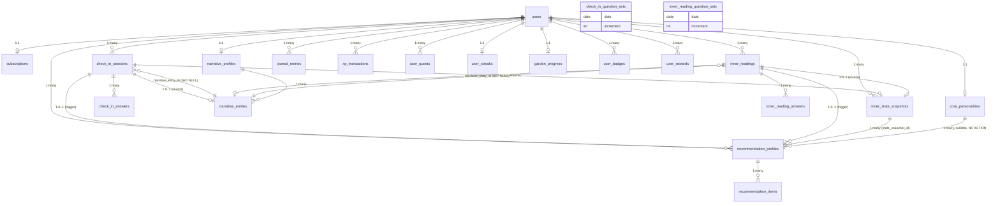
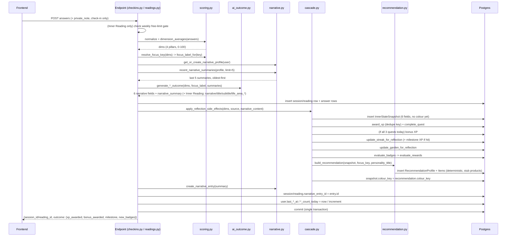

# delivery_log_0001 — The whole web: models, logic, and how everything connects

**Status:** Comprehensive system reference, current as of `2026-09-24`
(migration head `d9b5ce16447b`). Not a plan and not a findings report —
those already exist (`behaviour_log_0001`–`0008`, `dev_log_0001`–`0004`,
`database_audit_2026-09-23.md`, `todo_log_0001.md`). This document exists
to describe, in one place, every table, every relationship, and every
piece of business logic that connects them — the full shape of the
Core Personality / Emotional Check-In / Inner Reading / Narrative module,
as it actually runs today. Where something is a known, deliberate gap
(personalized AI recommendations, real product API), it's marked as such
and left for later — not re-litigated here.

## 1. The backbone, one paragraph

A user onboards with a birthdate, which deterministically generates a
`CorePersonality` (numerology + 5-colour breakdown, bilingual text) —
stable identity, not re-scored per reflection. From there, two reflection
types — quick **Emotional Check-In** (4 questions) and deeper **Inner
Reading** (8 questions) — both score the same 4 pillars
(`emotional_energy`, `mental_clarity`, `inner_pressure`, `grounding`)
deterministically from raw answers, then call an AI step to write
narrative text (never numbers) grounded on those scores plus the user's
own recent history. Every submission writes an `InnerStateSnapshot`
(the dashboard's state), a `NarrativeEntry` (short AI memory, feeds
*future* generations' continuity — not yet recommendations), and a
`RecommendationProfile` (currently deterministic tag-matching over a
stub product list, not yet AI or Narrative-grounded — confirmed gap,
`behaviour_log_0008.md`). Around all of this sits a shared gamification
layer (XP, streaks, a garden, badges, rewards) that every reflection
feeds identically regardless of which type triggered it.

## 2. Entity-relationship map

`check_in_question_sets`/`inner_reading_question_sets` are deliberately
disconnected from everything else — global caches, no FK to any session,
reading, or user. See §4.

## 3. Per-domain models and logic

### 3.1 Identity — `users`, `subscriptions`

**`users`** — the root of ownership; every other user-scoped table FKs to
it with `ondelete="CASCADE"`. Beyond auth fields (`email`, `password_hash`,
`gid`, `status`), it carries the raw facts two separate daily-increment
schemes are built on:
- `last_check_in_at` / `check_in_count_today` — Emotional Check-In's
  daily question-set increment (`behaviour_log_0006.md`).
- `last_inner_reading_at` / `inner_reading_count_today` — Inner Reading's
  own, deliberately separate, mirror of the same mechanism
  (`behaviour_log_0007.md`) — never conflated with the weekly free/Premium
  reading limit, which is computed independently (§3.7).

Both pairs are **read-only at question-fetch time** and only persisted at
submit time (`services/questions.py::next_check_in_increment`/
`next_inner_reading_increment` are pure calculations; the endpoints write
the actual columns after a successful submission) — so opening the
question screen and abandoning it never advances a user's daily count.

**`subscriptions`** — 1:1 with `users`, created together at registration
(FREE/ACTIVE). `services/entitlement.py::is_premium_active` is the single
source of truth for Premium access: an unexpired `trial_ends_at` grants
it regardless of `plan`; otherwise `plan=PREMIUM` with `status` ACTIVE or
PENDING grants it; a CANCELLED Premium plan still grants it until
`expires_at`. This one function gates: check-in history depth (7 days
free vs. unlimited), Inner Reading's weekly free limit (3/7 days),
monthly trend access, and recommendation product count (1 vs. 3).
No payment integration exists — `POST /subscription/subscribe` grants
PREMIUM directly (`database_audit_2026-09-23.md` F5).

### 3.2 Core Personality — `core_personalities`

1:1 with `users`, generated once at onboarding
(`POST /core-personality/calculate`), not versioned/re-quizzed. Two parts:
- **Deterministic numbers** — `services/numerology.py` computes
  `birthday_number`, `life_path_number`, `talent_number` (a formatted
  string like `"38/2"`, not a plain integer — richer than a single
  reduced digit), and 5 colour-affinity scores
  (scarlet/russet/gold/forest/ocean), purely from the birthdate string.
  No AI involved in the numbers themselves.
- **Bilingual generated text** — title/subtitle/overview plus a
  content blurb per number, generated by AI framed *as if* it were a
  reading of the deterministic numbers above (`behaviour_log_0002.md`/
  `0004.md`). Written first in the requested `primary_language`
  (`generation_status=PARTIAL`), then a FastAPI background task fills the
  other language and flips to `READY`. No durable retry if that
  background task fails mid-flight — `database_audit_2026-09-23.md` F9.
- `summary_en`/`summary_zh` — AI-grounding context for a future
  recommendation step, not user-facing copy. Currently unread by
  anything (confirmed gap, §3.6).

Read by: `GET /core-personality/current`, and — critically — every
reflection submission via `user.core_personality` (relationship, not a
query), which supplies `personality_title` to the AI outcome prompt's
context and to `RecommendationProfile`'s routine-reason wording. Nothing
downstream uses the numeric colour scores as a selection input yet.

### 3.3 Emotional Check-In

**`check_in_question_sets`** — a global cache, not per-user, keyed by
`(date, increment)` with a unique constraint. `increment` means "this is
the Nth check-in of the day, across all users" — the first user to start
their 1st check-in of a given UTC day generates the 4-question set (AI,
`services/ai_questions.py::generate_checkin_questions`, `reasoning={"effort":"medium"}`,
no `temperature`); every other user's 1st check-in that day reuses the
same row. A user's 2nd-of-the-day check-in triggers its own separate
generation at `increment=2`, likewise shared. No FK from any session or
answer back to the row it was generated from — the submitted answers
carry their own copy of `question_text`, not a reference
(`database_audit_2026-09-23.md` F12).

**`check_in_sessions`** — one row per submitted check-in
(`POST /check-ins`). `blueprint_version` is currently hardcoded to
`"checkin-v1-demo"` even though questions are real AI — a labeling
mismatch, not a functional bug (F3 in the audit). `summary` is a short
**deterministic** label (`f"Check-in — {focus_label}"`, built from
`resolve_focus_key`/`FOCUS_COPY` — never AI), explicitly kept separate in
purpose from `narrative_entry_id`'s AI memory (`behaviour_log_0006.md`
Phase 4's resolved open question — Narrative is the one AI-facing memory
record for the event, this is just a display label). `private_note` is
stored and returned to the client but never read by the AI outcome
prompt.

**`check_in_answers`** — one row per answer, `answer_value` (raw 1-5) and
`normalized_value` (0/25/50/75/100, via `scoring.py::normalize`) both
stored. No server-side validation of dimension names, answer count, or
the 1-5 range today (`database_audit_2026-09-23.md` F3) — the request
schema (`AnswerIn`) accepts arbitrary strings/integers.

### 3.4 Inner Reading

**`inner_reading_question_sets`** — exact structural mirror of check-in's
cache: `(date, increment)`, shared across users, AI-generated
(`generate_reading_questions`, same reasoning-effort setting). The
difference is entirely in the prompt: 8 questions (2 per pillar, each
pair required to be "meaningfully different, not near-duplicates"),
retrospective framing ("looking back over the last few days...") instead
of check-in's present-moment framing — the one deliberate content
difference between the two practices, per `behaviour_log_0007.md`'s
resolved "question depth" open question.

**`inner_readings`** — one row per submission
(`POST /inner-readings`), gated by a **separate, unrelated** rule from
the question-set cache: non-Premium users are refused past 3 COMPLETED
readings in a rolling 7-day window
(`entitlement.py::inner_reading_weekly_count`). Unlike check-in,
this model keeps its own AI-generated content directly on the row —
`narrative`, `insight`, `reflection_question`, `title`, `subtitle`,
`life_area_insights` (JSONB, one paragraph per
work/relationships/personal_growth/conflict_management) — a deliberate
choice made in `behaviour_log_0007.md` to avoid frontend churn, *not*
because the architecture couldn't have consolidated onto
`InnerStateSnapshot` the way check-in did. `category`/`emoji` (Personal
🌙 / Decision Making 🌊 / Work 🌿 / Recovery 🪨 / Reflection ✨) are
**not stored columns** — computed at serialization time from the row's
own pillar scores via `scoring.py::reading_category_and_emoji`, added
later than the rest of this feature specifically for listing-card display
(hub "Recent Readings" and `/inner-reading/history`).

**Read-time depth gating** — `reading_content_for_plan` (not a write-time
decision): Premium sees the full `narrative` and `life_area_insights`;
free sees `narrative` truncated to 100 words and `life_area_insights`
withheld entirely. Upgrading retroactively unlocks full depth on
*already-taken* readings, since nothing is rewritten — the gate is purely
a read-time filter. `category`/`emoji` are never gated (display
metadata, not depth content).

**`inner_reading_answers`** — structurally identical to check-in answers.
One real gap: `InnerReadingOut` has no `answers` field, so this history is
recorded but never actually returned to the frontend today
(`database_audit_2026-09-23.md` §6).

### 3.5 `inner_state_snapshots` — the shared timeline

One row per successful submission of *either* type — the
`CheckConstraint` enforces exactly one of `check_in_session_id`/
`inner_reading_id` set, never both/neither. Written entirely by
`services/cascade.py::apply_reflection_side_effects`, the single shared
writer both submission handlers call. Six narrative fields
(`insight`, `reflection_question`, `reminder`, `current_focus`,
`friendly_advice`, `affirmation`) are JSONB `{"en", "zh"}` pairs — `zh` is
always `null` today (check-in/reading content is English-only by
design, not a bug); `colour_key` is filled in the same transaction after
`build_recommendation` runs, denormalizing the recommendation's colour
choice back onto the snapshot it came from.

This is the one table both reflection types now populate identically —
before `behaviour_log_0007.md`, Inner Reading's snapshots always had
`narrative_content=None` and these six fields stayed null; that's what
"closing the gap" in that document actually meant structurally.

Read by `GET /state-snapshots/latest` (dashboard's current state) and
`GET /state-snapshots/trend` (`services/trend.py` — carries the last
known snapshot forward across days with no new submission, leaves future
days `NULL`, does not average same-day multiple submissions, just takes
the latest). `summary_en`/`summary_zh` on this table are, like Core
Personality's, unread by anything — reserved for the future
recommendation AI step.

### 3.6 Narrative — `narrative_profiles`, `narrative_entries`

`NarrativeProfile` is a pure 1:1 container per user (`get_or_create_narrative_profile`,
lazily created on a user's *first* successful reflection — not at
registration). `NarrativeEntry` is one row per check-in/reading, written
by `services/narrative.py::create_narrative_entry` with
`ai_outcome.narrative_summary` — a factual, third-person, ≤20-word
summary the AI writes in the *same* call as the six user-facing fields
(not a second round trip), explicitly not user-facing.

**The one read path**: `recent_narrative_summaries` fetches the last 5
entries (composite index `(narrative_profile_id, created_at DESC)`
exists specifically for this), reverses to oldest-first, and hands them
to `ai_outcome.py`'s prompt as continuity context — *"do not contradict
this, reference a pattern if genuinely present."* This is the entire
current consumer of Narrative. It is **not** read by
`recommendation.py` — confirmed by grep in `behaviour_log_0008.md`. The
event being submitted is never included in its own memory context (the
entry is created *after* the outcome that used the prior 5 already
generated).

### 3.7 Recommendation — `recommendation_profiles`, `recommendation_items` (known TODO)

Written by `services/recommendation.py::build_recommendation`, called
from inside the same cascade transaction as the snapshot write. **Current
implementation, explicitly confirmed as a placeholder** (per this
session's earlier confirmation — real AI + real product API are deferred,
not started):

- **No AI call.** `resolve_focus_key(dims)` → static
  `content.py::FOCUS_COPY` (focus label + summary text) →
  `FOCUS_TO_COLOUR` (colour key + product tags + a canned routine
  sentence) — five fixed focus keys, five fixed outcomes, the same every
  time a user lands on that focus.
- **No Narrative read.** Despite `cascade.py` having a parameter named
  `narrative_content`, that's the six AI outcome fields being written to
  the snapshot — an unrelated, confusingly similarly-named thing, not a
  read of `NarrativeEntry`.
- **No real product source.** `_fetch_products_stub()` is a hardcoded
  7-item list. Its own docstring says the real system needs a
  third-party ecommerce API call plus an AI selection step — neither
  exists.
- Core Personality is used, but only for wording (the personality title
  drops into the routine's reason sentence) — not as a selection input.

`RecommendationItem` rows (COLOUR rank 1, ROUTINE rank 2, PRODUCT rank
3+, capped at 1 for free / 3 for Premium) are historical output
snapshots — copied title/price/image at generation time, not live
references to a catalog. `GET /recommendations/latest` and
`GET /recommendations` (history, Premium-only beyond the latest one) are
the read paths; the colour-psychology page and dashboard both consume
this. **This is the one deferred piece of the backbone** — see
`behaviour_log_0008.md` for the full confirmation of this gap and why
it's not being closed in this pass.

### 3.8 Gamification — six tables, one shared trigger

Every reflection submission (check-in or reading, identically) drives
this entire layer through `cascade.py`, in a fixed order:

1. **`xp_transactions`** — append-only ledger, `UNIQUE(user_id, source_key)`
   is the dedupe mechanism (`award_xp` returns 0 silently on a repeat
   key, no error). Check-in: 10 XP, key `CHECK_IN:{date}`. Reading: 25
   XP, key `INNER_READING:{date}`. Only the *first* of each type per UTC
   day earns XP — a 2nd same-day check-in still writes a full snapshot/
   narrative/recommendation bundle, just no XP.
2. **`user_quests`** — `UNIQUE(user_id, quest, date)`, one row per
   quest/day. Backend callers only ever write `CHECK_IN`/`INNER_READING`
   — **`LOGIN` is never written by any backend path** (only the retired
   local-storage mock wrote it), so `all_three_quests_complete`'s 10-XP
   daily bonus is currently unreachable through real login
   (`database_audit_2026-09-23.md` F2, still open).
3. **`user_streaks`** — one mutable row/user. Same UTC day as last
   reflection → no change; exactly yesterday → `current += 1`; any older
   gap → reset to 1. `best` only ever increases. Milestones (7/30/100
   days) each award their XP exactly once per user, ever, tracked via the
   `milestones_awarded` array — hitting 7 again after a reset doesn't
   re-pay it.
4. **`garden_progress`** — one mutable row/user, Monday-UTC weeks
   (`week_start`), reset to stage 0 lazily on the first touch of a new
   week (not a scheduled job — `GET /progress` itself can trigger this
   reset just by being viewed). `stage = min(4, actions_this_week)` —
   every reflection of either type adds one action, so 4 reflections in
   one day fully blooms the garden regardless of type mix.
5. **`user_badges`** — `evaluate_badges` checks `streak_best`,
   lifetime completed-readings count, current garden stage, and total XP
   against 6 fixed thresholds; append-only, never revoked even if the
   underlying stat later regresses (streak resets don't un-earn
   `three_day_streak`).
6. **`user_rewards`** — `evaluate_rewards` checks XP/streak-best/badge-count
   thresholds from `content.py::REWARD_DEFINITIONS`, inserts `UNLOCKED`.
   Separately, `POST /rewards/{key}/redeem` flips `UNLOCKED → REDEEMED` —
   no XP cost, no Premium requirement, no external fulfillment.

`GET /progress` is the one read endpoint surfacing all six at once
(`xp_total`, `streak`, `garden`, `quests_today`, `badges` merged with
static definitions for earned/unearned display).

### 3.9 Journal — `journal_entries`

Deliberately outside the reflection cascade entirely: `POST /journal/entries`
inserts content plus a `mood`/`theme` pair chosen by
`services/journal.py::tag_journal_entry` — a deterministic hash of the
entry's own UUID, **not** sentiment analysis of the content, despite
reading like it might be. No XP, no quest, no streak/garden effect, no
Narrative entry, no AI call at all. `GET /journal/insights` aggregates
entry count and mood/theme frequency for the current vs. previous week
client-side-facing card.

## 4. Cross-cutting rules that apply everywhere

- **Deterministic vs. AI, strictly separated, everywhere in this
  module**: pillar scores (`dimension_averages`), the focus key
  (`resolve_focus_key`), colour selection, XP amounts, streak/garden/
  badge/reward thresholds, category/emoji — all pure code, zero model
  calls. The AI's job, in every one of the four generation call sites
  (`ai_personality.py`, both functions in `ai_questions.py`, both
  functions in `ai_outcome.py`), is text only: question wording, or
  narrative/insight/reflection/summary writing grounded on numbers
  already computed. No generation call is ever allowed to produce a
  number that gets scored.
- **`normalize`/`dimension_averages`/`resolve_focus_key`** (`scoring.py`)
  are the one shared scoring core both reflection types use unmodified —
  Inner Reading's 8-answer, 2-per-pillar input averages through the exact
  same function as check-in's 4-answer input, confirmed live in
  `behaviour_log_0007.md`'s Phase 3 verification. A tie in "need" between
  two dimensions resolves via Python's stable sort favoring
  `emotional_energy > mental_clarity > inner_pressure > grounding` — a
  real, documented (not accidental) behavior, `behaviour_log_0006.md`.
- **The shared cascade is the one write path for state/gamification/
  recommendation**, `cascade.py::apply_reflection_side_effects`, called
  by both `checkins.py::submit_check_in` and
  `readings.py::submit_inner_reading` with the same signature. Fixing a
  bug in this function (or in `recommendation.py`, which it calls)
  affects both reflection types simultaneously — this already happened
  once (`behaviour_log_0006.md` Phase 4 had to repair a stale
  `CorePersonality.archetype`/`is_current` reference in this shared path,
  which meant fixing Inner Reading's call site too even though its own
  AI outcome work was a separate phase).
- **The two question-set caches are shared across *all* users**, not
  per-user — the first user to hit a given `(date, increment)` pays the
  generation cost; every other user (and every subsequent same-key
  request from the *same* user) reads the cached row. No cache
  invalidation/expiry job exists; a bad generation is live for every
  user at that key for the rest of the day (flagged as a real risk in
  `todo_log_0001.md`).
- **`autoflush=False`** (`database.py`) means a query inside a request
  does not see an uncommitted insert from earlier in the *same* request
  until something explicitly flushes — the cascade's own multi-step
  sequence (snapshot → XP/quest → streak → garden → badges → rewards →
  recommendation) relies on its own explicit `db.flush()` calls between
  steps that need to see each other's writes.
- **No request idempotency, no row locking** on any submission path —
  retrying a successful `POST /check-ins`/`POST /inner-readings` creates
  a fully duplicate session/snapshot/narrative/recommendation bundle
  (XP alone is protected, via the dedupe key). Concurrent requests at
  the daily-increment or weekly-limit boundary can race. Not reproduced
  against live data — a static-analysis finding, `database_audit_2026-09-23.md` F4.
- **Everything datewise is UTC**, including the "daily" in both
  increment schemes, XP dedupe keys, quest dates, and garden weeks —
  `users.timezone` is stored and editable but not applied to any of
  these rules yet.

## 5. Full submission flow, step by step

Both handlers follow the identical shape; Inner Reading additionally
checks the weekly free-limit gate first and generates its outcome
*before* inserting the parent row (check-in inserts the session first,
then generates):

One committed transaction per submission — a failure anywhere before the
final commit leaves no partial bundle visible to the next request
(`database.py`'s session-per-request pattern), but a failure has no
automatic retry/recovery path either.

## 6. Where to go for more

- **Feature-by-feature build history and phase-by-phase decisions**:
  `behaviour_log_0001.md`–`0007.md` (Core Personality, its bilingual
  content, Narrative's model design, Check-In's real-AI rebuild, Inner
  Reading's real-AI rebuild).
- **The confirmed architecture-vs-implementation gap** (recommendations
  not yet AI/Narrative-grounded, no real product API):
  `behaviour_log_0008.md`.
- **Frontend wiring, page-by-page, and every bug the migration off the
  mock surfaced**: `gio-member-app/docs/dev_log_0001.md`–`0004.md`.
- **Full findings-oriented audit** (severity-ranked risks, concurrency
  concerns, stale comments, unpaginated queries): `database_audit_2026-09-23.md`.
- **Deferred quality work, not architectural gaps**: `todo_log_0001.md`
  (check-in question phrasing consistency).
